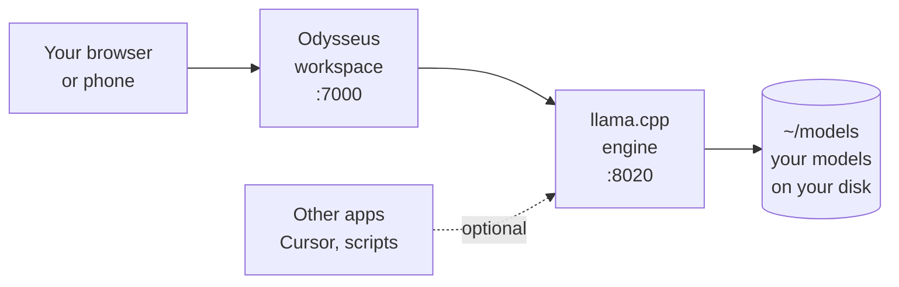

# PatterOS

**Turn an ordinary Linux machine into a private AI workstation that runs
entirely on your own hardware.**

No subscription, no API key, no data leaving the building. You run the models,
on your computer, for the cost of the electricity.

Companion files for the **PatterOS · Local AI Budget Build**
[video series](https://www.youtube.com/@Daniel_Parke), from
[PatterTech](https://github.com/Daniel-Parke).

> **1 token per second is infinitely more than 0.** Everything after that is
> just profit. If your hardware is older or smaller than you would like, start
> anyway.

---

## What you end up with



Two pieces, both started automatically when your computer boots, and **both
private to your machine unless you deliberately choose otherwise**:

- **A model server** that runs the AI, and speaks the same API most AI software
  already understands.
- **A web workspace** for chatting, writing, notes, documents and agents.

---

## Will it run on my computer?

Probably. This is the short version:

| What you have | Will it work? | What to expect |
|---|---|---|
| **NVIDIA card** | Yes, tested by us | The fastest option. CUDA. |
| **AMD card** | Yes, tested by us | Uses Vulkan, no vendor toolkit needed |
| **Intel Arc / Intel iGPU** | Untested by us | The installer still takes the Vulkan path, same as AMD. If it fails, `--cpu` runs on the processor, and an issue report is welcome |
| **Built-in graphics only** | Yes | Smaller models, slower. Intel built-in graphics is untested; see the Intel row |
| **No graphics card at all** | Yes, tested by us | Runs on the processor. Slower, but it genuinely works |

**You also need:** Linux Mint 22 or Ubuntu 24.04, an internet connection, and
about 20 GB of free disk space for the default set of models. `--full` fetches
the bigger ones too and wants about 70 GB free.

**More memory on your graphics card means bigger models.** That is the one spec
that really decides things. A model either fits in memory or it does not.

| Graphics memory | Models that fit comfortably |
|---|---|
| None (processor only) | Gemma 4 E2B, 2.7 GB |
| 8 GB | E2B and E4B fully; 12B partly, and PatterOS sets that up for you |
| 16 GB | Up to Gemma 4 12B, 6.8 GB. Qwen 3.8 27B only as AD-IQ3_XXS (~11 GB), not the Q4s |
| 24 GB | Everything, including Gemma 4 31B (17.3 GB) and Qwen 3.8 27B Q4s (~16–17 GB) |

Not built a machine yet? Part 1 below has a full parts list from about £484.

---

## Start here

Three ways in. Pick whichever suits you.

### 1. Run the installer

```bash
git clone https://github.com/Daniel-Parke/PatterOS.git
cd PatterOS

# Read it first. Never run a script from the internet, ours included,
# without looking inside. It is heavily commented in plain English.
less scripts/install_local_ai.sh

sudo bash scripts/install_local_ai.sh
```

It asks what you want, checks your hardware, and tells you what it is about to
do before it does it. Everything is optional and everything can be undone.

<details>
<summary>Useful options</summary>

| Option | What it does |
|---|---|
| `--full` | Also download the bigger models. Needs a 24 GB card and about 70 GB free |
| `--no-models` | Set everything up, download nothing. Add models later |
| `--no-odysseus` | Model server only, no web workspace |
| `--cpu` | Ignore the graphics card and use the processor |
| `--skip-drivers` | Do not touch graphics drivers at all |
| `-y` | Do not ask anything. Assumes you have read the script |
| `--help` | The full list, including environment settings |

</details>

### 2. Do it by hand

Prefer not to run someone else's script on a new machine? Sensible instinct.
**[The manual setup guide](docs/part-2-manual-setup-guide.md)** does exactly the
same job one command at a time, with every step explained.

### 3. Just read about it

**[The Local AI Handbook](docs/local-ai-handbook.md)** covers the ideas behind
all of it. What a model actually is, how the pieces fit together, and what local
AI can realistically do. No background assumed.

---

## When it is finished

| What | Where |
|---|---|
| Web workspace | <http://localhost:7000> |
| Model server | <http://localhost:8020/v1> |
| Your models | `~/models` |
| First-time login | `sudo cat /var/lib/patteros/odysseus-first-login.txt` |

```bash
# What models do I have?
curl http://localhost:8020/v1/models

# Added a new one? Tell the server to look again.
curl 'http://localhost:8020/v1/models?reload=1'
```

Reaching it from another computer or your phone is a deliberate extra step, and
[Steps 10 and 11 of the guide](docs/part-2-manual-setup-guide.md) walk through
doing it safely.

---

## Changed your mind?

```bash
# See exactly what would be removed, without removing anything
sudo bash scripts/uninstall_local_ai.sh --dry-run

# Put things back
sudo bash scripts/uninstall_local_ai.sh
```

It keeps your downloaded models by default, because they are slow to fetch
again. `--all` removes everything.

---

## The video series

| Part | What it covers | Files here |
|---|---|---|
| **1. Building the rig** | Choosing parts, the full bill of materials, and putting it together. From about £484 | [Parts list and build guide](docs/PatterOS_AI_Rig_BOM_and_Build_Guide.docx) (Word) |
| **2. Setting it up** | Fresh Linux install to working AI workstation | [Installer](scripts/install_local_ai.sh) · [uninstaller](scripts/uninstall_local_ai.sh) · [manual guide](docs/part-2-manual-setup-guide.md) |
| **3. Comparing models** | The same hard research task across nine model and quantisation combinations, unedited | [Results and method](docs/model-tests/) |

---

## What gets installed

All of it is optional, and none of it is ours. These are separate open-source
projects with their own licences:

| Project | Licence | What it does here |
|---|---|---|
| [llama.cpp](https://github.com/ggml-org/llama.cpp) | MIT | Runs the models. Built from source, pinned to a tested version |
| [Odysseus](https://github.com/odysseus-dev/odysseus) | AGPL-3.0 | The web workspace. Installed and run unmodified, pinned to a commit |
| [LACT](https://github.com/ilya-zlobintsev/LACT) | MIT | Optional. Graphics card power and fan tuning |
| [Gemma 4](https://huggingface.co/unsloth) | Apache 2.0 | The default models, downloaded from Hugging Face |
| [Qwen 3.8 27B](https://huggingface.co/unsloth) | Apache 2.0, and one undeclared | Two more models, on `--full` only. See the note below |

**A word about Odysseus.** It includes an AI agent that can run commands and read
files. PatterOS keeps it on your machine only. Do not expose it to the internet.

**A word about the Qwen licence.** `--full` fetches two builds of Qwen 3.8 27B.
Unsloth's states Apache 2.0 on its model card. AtomicChat's states nothing. It is
an ungated quantisation of Qwen/Qwen3.8-27B, which is Apache 2.0, so the grant
should carry through, but we have not been able to confirm that from the
publisher themselves. If you need a licence you can point at, use the Unsloth
build. See [NOTICE](NOTICE).

---

## Contributing

Bug reports, corrections and code are all welcome, and no question is too basic.
See **[CONTRIBUTING.md](CONTRIBUTING.md)** to get started, or
**[SECURITY.md](SECURITY.md)** if you have found something that should be
reported privately.

What changed and why: **[CHANGELOG.md](CHANGELOG.md)**.

---

## Licensing

Code and documentation here are under the [Apache License 2.0](LICENSE). See
also [NOTICE](NOTICE).

The names **Patter**, **PatterOS**, **PatterStage** and **PatterTech**, and the
visual identity in [`branding/`](branding/), are **not** covered by that licence.
See [TRADEMARK.md](TRADEMARK.md). Forking? [REBRANDING.md](REBRANDING.md) is a
short checklist.

---

<div align="center">

**Your hardware. Your data. Your control.**

</div>
